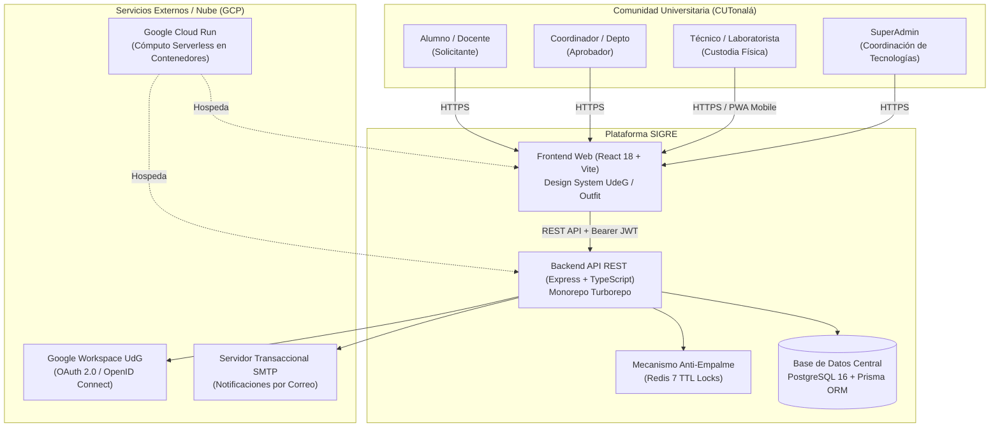
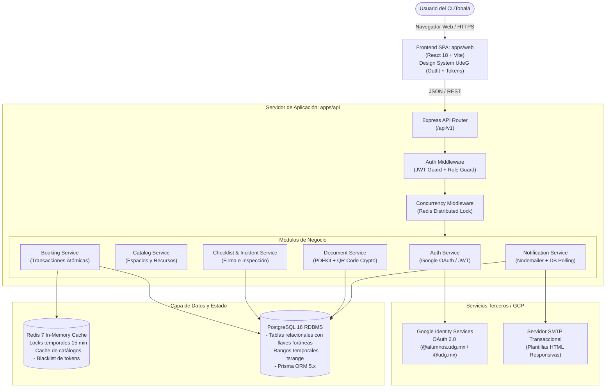
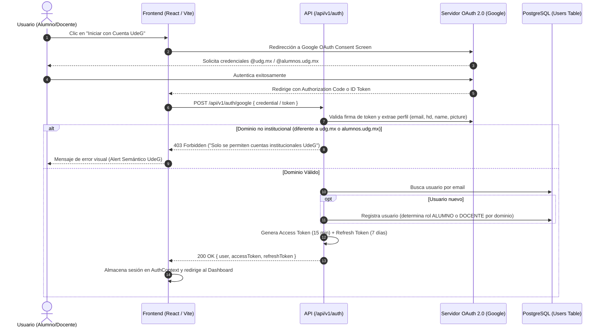
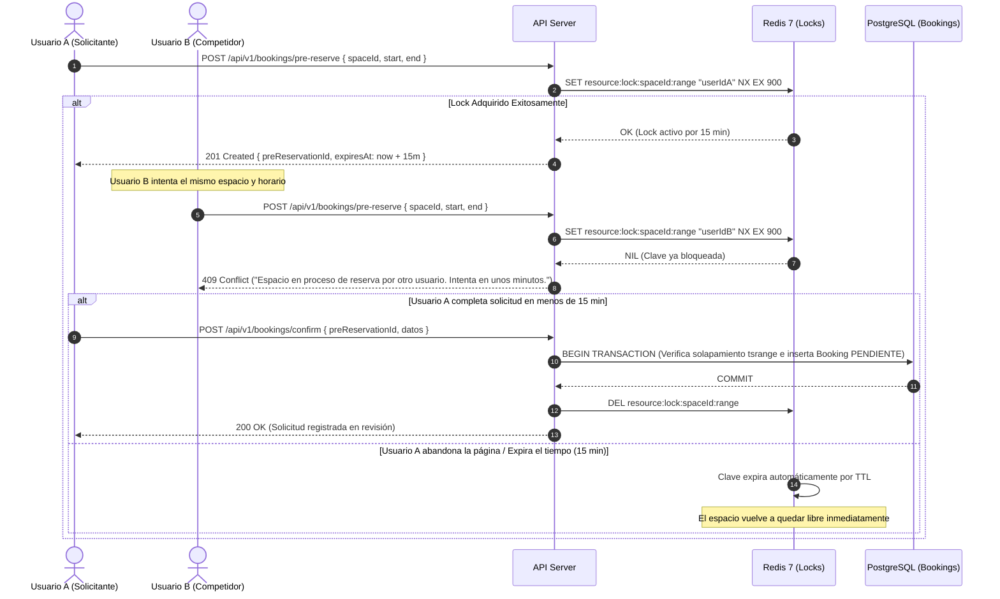
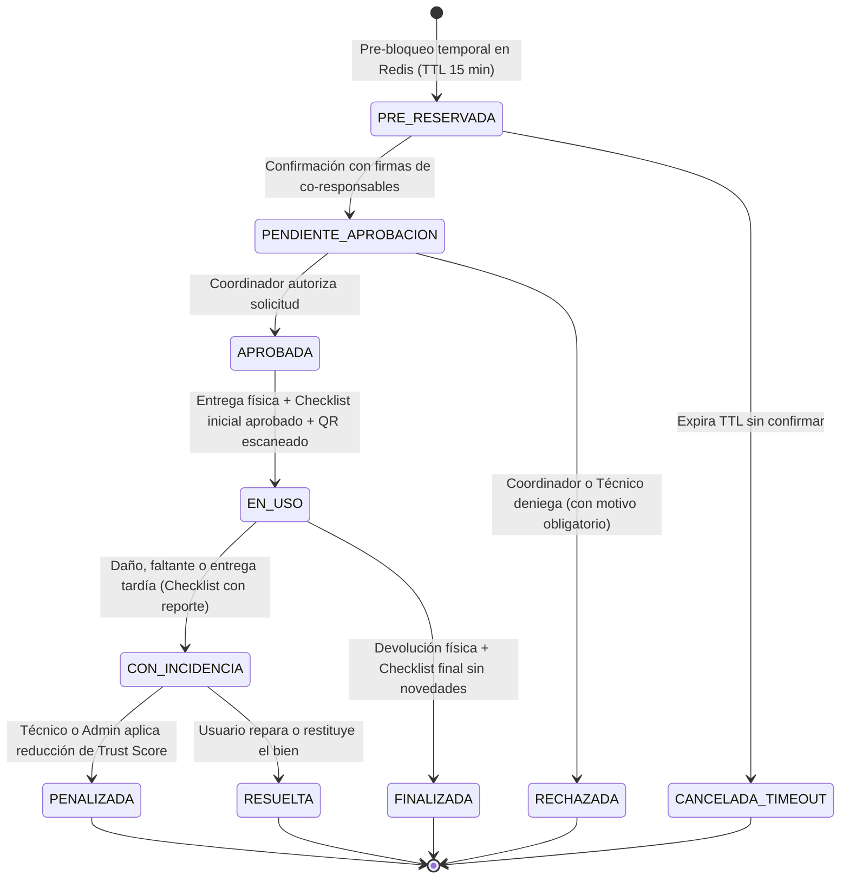
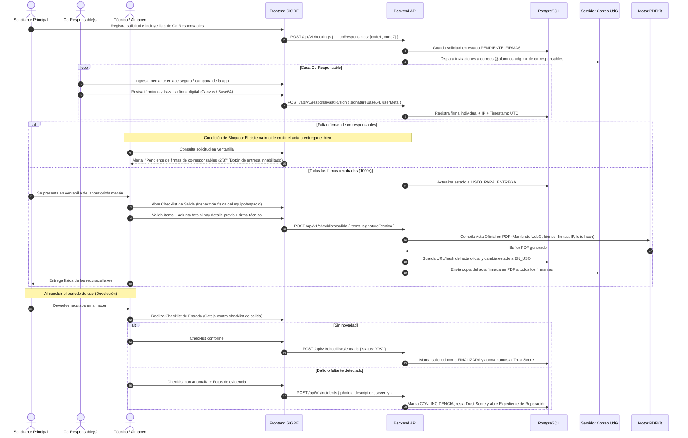
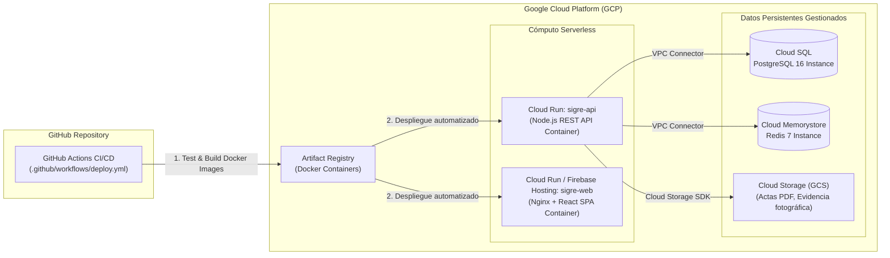

# 🏛️ Documento de Arquitectura de Software — SIGRE v1.0

**Proyecto:** SIGRE (Sistema Integrado de Gestión de Recursos y Espacios)  
**Institución:** Centro Universitario de Tonalá (CUTonalá) — Universidad de Guadalajara  
**Versión de Arquitectura:** 1.0  
**Fecha:** Octubre 2026  
**Estado:** Aprobado / En Implementación  

---

## 1. Visión General del Sistema y Contexto

SIGRE es una plataforma integral diseñada para resolver la problemática histórica del CUTonalá en la gestión, reserva y trazabilidad de espacios físicos (aulas, laboratorios, auditorios, cubículos) y materiales especializados (cámaras, equipo de cómputo, proyectores, kits de electrónica).

El sistema centraliza las operaciones de los diferentes actores de la comunidad universitaria:
- **Alumnos y Docentes (Solicitantes/Custodios):** Solicitan espacios y materiales con cuentas institucionales `@alumnos.udg.mx` o `@udg.mx`.
- **Coordinadores y Jefes de Departamento (Aprobadores):** Validan pertinencia académica y disponibilidad.
- **Técnicos y Operadores de Laboratorio (Entregas y Recepciones):** Verifican el estado físico del material/espacio con listas de verificación (*checklists*) digitales.
- **Administrador General (SuperAdmin):** Gestiona catálogos, políticas, auditoría de usuarios y reportes métricos.



---

## 2. Arquitectura de Código: Monorepo Turborepo

El proyecto está estructurado como un **Monorepo** gestionado mediante **Turborepo** y **pnpm workspaces**, lo que garantiza consistencia de dependencias, tipado unificado y reutilización de lógica entre cliente y servidor.

```
Inversion/ (Raíz del Repositorio)
├── apps/
│   ├── api/                     # Backend Node.js + Express + TypeScript
│   │   ├── src/
│   │   │   ├── config/          # Variables de entorno validadas con Zod
│   │   │   ├── controllers/     # Controladores HTTP por módulo
│   │   │   ├── middleware/      # Auth, Roles, RateLimit, Concurrencia
│   │   │   ├── routes/          # Definición de rutas REST
│   │   │   ├── services/        # Lógica de negocio pura (Auth, Mail, QR, PDF)
│   │   │   └── utils/           # Helpers y encriptación
│   │   └── package.json
│   │
│   └── web/                     # Frontend SPA React 18 + TypeScript + Vite
│       ├── src/
│       │   ├── assets/          # Logos SVG, íconos de marca SIGRE
│       │   ├── components/      # Componentes UI basados en la Guía de Marca
│       │   ├── context/         # AuthContext, ThemeContext (Dark/Light)
│       │   ├── hooks/           # Custom hooks (useAuth, useFetch, useSocket)
│       │   ├── pages/           # Vistas organizadas por rol (18 pantallas)
│       │   ├── services/        # Clientes Axios / API Fetchers
│       │   ├── styles/          # Variables CSS (:root, design tokens)
│       │   └── types/           # Tipos de interfaz compartidos
│       └── package.json
│
├── packages/
│   ├── database/                # Acceso a datos y persistencia
│   │   ├── prisma/
│   │   │   ├── schema.prisma    # Definición declarativa de modelos PostgreSQL
│   │   │   ├── migrations/      # Historial de migraciones SQL
│   │   │   └── seed.ts          # Población inicial de catálogos y admin
│   │   └── src/index.ts         # Exportación del cliente tipado de Prisma
│   │
│   ├── shared/                  # Constantes, tipos y validadores Zod compartidos
│   └── eslint-config/           # Reglas de linter unificadas
│
├── infra/
│   ├── docker-compose.yml       # Orquestación local (PostgreSQL 16 + Redis 7)
│   └── README.md
│
└── docs/
    ├── arquitectura/            # Documentación y diagramas técnicos
    ├── brand/                   # Activos gráficos vectoriales (.svg)
    └── tecnica/                 # Especificaciones de endpoints y seguridad
```

---

## 3. Diagrama de Contenedores y Servicios



---

## 4. Flujos Críticos de Negocio y Seguridad

### 4.1 Flujo de Autenticación Institucional Exclusiva (Google OAuth 2.0)

**Directiva:** Únicamente se permite el acceso a usuarios con cuentas oficiales de la Universidad de Guadalajara (`@alumnos.udg.mx` para estudiantes y `@udg.mx` para académicos y administrativos).



---

### 4.2 Flujo Anti-Empalme: Concurrencia Distribuida con Redis (15 Minutos TTL)

**Problema:** Dos usuarios seleccionan el mismo Auditorio o Laboratorio para el mismo día y bloque de horas al mismo tiempo.  
**Solución Arquitectónica:** Se implementa un mecanismo de **Reserva Temporal (Soft Lock)** en Redis con tiempo de vida (TTL) de 15 minutos mientras el usuario llena justificación, sube responsivas o invita co-responsables.



---

### 4.3 Ciclo de Vida y Máquina de Estados de Reservas y Préstamos



---

### 4.4 Verificación de Asistencia con Código QR Criptográfico

Para eventos multitudinarios en auditorios, aulas magnas y salas de conferencias:
1. El backend genera un payload con: `userId`, `bookingId`, `timestamp`, `nonce`.
2. El payload se firma digitalmente con algoritmo **HMAC-SHA256** utilizando una clave secreta del servidor.
3. Se genera la imagen QR vectorial (`qrcode`).
4. Al momento del acceso, el staff o técnico escanea el QR desde la app web o móvil.
5. El servidor valida la firma criptográfica, la vigencia temporal y marca el registro de asistencia atómico, bloqueando reusos del mismo QR.

---

### 4.5 Flujo de Responsivas Oficiales, Co-Responsables y Doble Checklist

**Directiva (RF-02.3 / RF-04.1):** Ningún recurso o espacio es entregado sin un Acta de Responsiva formal debidamente firmada por todos los involucrados y respaldada por el checklist de salida.



#### Reglas de Integridad del Acta Responsiva:
1. **Condición de Bloqueo Estricto:** La API rechaza cualquier intento de pasar el estado a `EN_USO` o `DELIVERED` si el contador de firmas confirmadas es menor al número de custodios registrados.
2. **No Repudio:** Cada trazo de firma se almacena en Base64 junto con el Hash SHA-256 del contenido del documento, dirección IP remota y marca de tiempo en milisegundos.
3. **Copia Inmutable:** El archivo PDF resultante se almacena con nombre canónico (`actas/RESP-AÑO-FOLIO.pdf`) y se distribuye copia digital por correo a las cuentas `@alumnos.udg.mx` de todos los involucrados.


---

## 5. Estrategia de Despliegue en la Nube (GCP Cloud Run)

La arquitectura de despliegue está optimizada para **Google Cloud Platform (GCP)** aprovechando la eficiencia de costos y escalabilidad automática a cero cuando no hay tráfico:



### Ventajas de esta arquitectura en GCP:
- **Zero Idle Cost:** Cloud Run escala a 0 instancias en noches o vacaciones escolares cuando no hay solicitudes.
- **Seguridad perimetral:** Las conexiones entre Cloud Run, Cloud SQL y Memorystore se realizan mediante VPC Privada (Serverless VPC Access Connector), sin exponer puertos de base de datos a internet público.
- **Certificados SSL automáticos:** Gestión de HTTPS transparente con dominios institucionales.

---

## 6. Sistema de Diseño e Identidad Visual (Design Tokens)

Toda la interfaz del sistema se rige estrictamente por la **Guía de Identidad de Marca** ([docs/sigre_brand_identity.md](file:///c:/Users/erfierro/Documents/Inversion/docs/sigre_brand_identity.md)):

| Token de Marca | Valor Hex | Significado Institucional |
|:---|:---|:---|
| `--color-primary` | `#002B49` | **Azul Institucional UdeG** (Seriedad, patrimonio, confianza) |
| `--color-accent` | `#2E7D57` | **Verde Natural CUTonalá** (Campus sustentable, transparencia, activos) |
| `--color-bridge` | `#1A6B5A` | **Transición Azul-Verde** (Interacciones hover, gradiente del logo "S") |
| `--bg-base` | `#FFFFFF` / `#0D1B2A` | Modo claro y modo oscuro profundo |
| `--font-family` | `'Outfit', sans-serif` | Tipografía geométrica institucional moderna |
| `--font-mono` | `'JetBrains Mono', monospace` | Para códigos de inventario, folios y firmas QR |

---

## 7. Próximos Pasos Técnicos para Completar el Sistema

1. **Infraestructura Base:** Ejecutar `docker compose up -d` en `infra/` para levantar PostgreSQL y Redis.
2. **Esquema de Datos:** Aplicar las migraciones de Prisma y poblar el catálogo de espacios y roles con `prisma db seed`.
3. **Controladores Backend:** Terminar los endpoints pendientes de acuerdo al plan maestro.
4. **Vistas Frontend:** Montar la interfaz con React 18, Vite y los tokens de diseño de SIGRE.
5. **Pipeline CI/CD:** Configurar el archivo `.github/workflows/deploy.yml` para despliegue automatizado en GCP Cloud Run.
