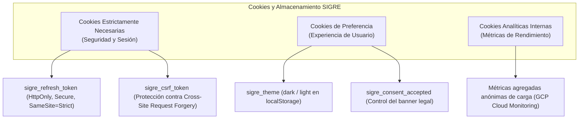
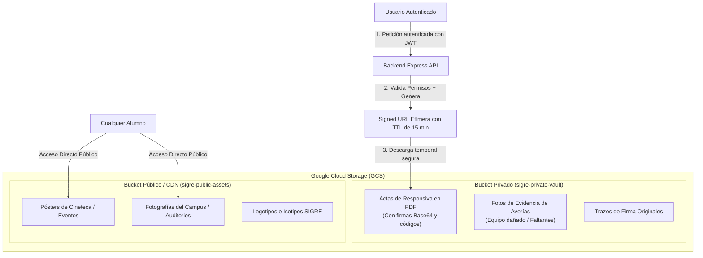

# ⚖️ Marco Legal, Privacidad, Cookies y Custodia Patrimonial — SIGRE

**Proyecto:** SIGRE (Sistema Integrado de Gestión de Recursos y Espacios)  
**Institución:** Centro Universitario de Tonalá (CUTonalá) — Universidad de Guadalajara  
**Ámbito Jurídico:** Legislación Federal Mexicana y Normatividad Institucional UdeG  
**Fecha:** Octubre 2026  

---

## 1. Fundamento Legal y Ámbito de Aplicación

La Universidad de Guadalajara (UdeG) y sus centros universitarios operan jurídicamente como **organismos públicos descentralizados del Estado de Jalisco, con autonomía, personalidad jurídica y patrimonio propios** (Ley Orgánica de la UdeG).

En consecuencia, el desarrollo, operación y almacenamiento de datos de la plataforma SIGRE se rige obligatoriamente por:

1. **Ley General de Protección de Datos Personales en Posesión de Sujetos Obligados (LGPDPPSO - México):**
   - Regula el tratamiento legítimo de datos personales por dependencias públicas y universidades autónomas (vigilada por el INAI).
2. **Ley de Protección de Datos Personales en Posesión de Sujetos Obligados del Estado de Jalisco y sus Municipios (ITEI):**
   - Normativa estatal supletoria en materia de transparencia y privacidad en Jalisco.
3. **Ley General de Bienes Nacionales y Código Civil del Estado de Jalisco:**
   - Sustento del comodato universitario, la custodia administrativa temporal y las cartas responsivas de bienes públicos.
4. **Ley de Firma Electrónica Avanzada:**
   - Validez legal del no repudio y manifestación de la voluntad por medios electrónicos.
5. **Estatuto General y Reglamento General de Alumnos de la Universidad de Guadalajara:**
   - Obligaciones expresas del estudiantado y docentes de preservar, cuidar y responder por el patrimonio institucional.

---

## 2. Clasificación de Datos Personales Tratados en SIGRE

| Categoría | Datos Recabados | Finalidad Primaria | Nivel de Seguridad |
|:---|:---|:---|:---|
| **Datos de Identificación** | Nombre completo, Código de Estudiante/Docente, Correo institucional (`@alumnos.udg.mx` / `@udg.mx`), Fotografía oficial Google | Autenticación, asignación de reservas y trazabilidad del usuario | **Medio** |
| **Datos Académicos** | Carrera / Licenciatura, Semestre, Centro Universitario (CUTonalá) | Control de acceso por perfil a espacios especializados o Cineteca | **Bajo** |
| **Datos Biométricos / Grafológicos** | Trazo de firma digitalizada en pantalla (Base64) | Manifestación de aceptación en actas de responsiva oficial | **Alto** |
| **Metadatos de Auditoría Informática** | Dirección IP pública/privada, Sellos de tiempo UTC, Agente de usuario (User-Agent) | Preservación de evidencia técnica, prevención de fraudes y no repudio | **Medio** |
| **Registros de Inspección Patrimonial** | Fotografía de bienes con averías, notas de estado físico | Sustento documental de incidencias y expedientes de reparación supervisada | **Medio** |

---

## 3. Política de Cookies y Almacenamiento Local (LocalStorage)

### 3.1 Enfoque de Privacidad por Diseño
A diferencia de portales comerciales o de e-commerce, **SIGRE NO utiliza cookies de publicidad, rastreo de perfiles comerciales, píxeles de remarketing (Facebook/Meta Pixel, Google Ads) ni comparte información con redes de terceros**.

### 3.2 Clasificación de Cookies Empleadas

1. **`sigre_refresh_token` (Estrictamente Necesaria):**
   - **Tipo:** Cookie HTTP-Only, con atributos `Secure` (solo HTTPS) y `SameSite=Strict`.
   - **Propósito:** Almacenar el token de refresco de sesión sin exponerlo a ataques de inyección JavaScript (XSS).
   - **Duración:** 7 días (expira automáticamente).
2. **`sigre_csrf_token` (Seguridad):**
   - **Propósito:** Token criptográfico para prevenir peticiones maliciosas forzadas entre sitios.
3. **`sigre_theme` (Preferencia Local):**
   - **Tipo:** `localStorage`.
   - **Propósito:** Recordar la preferencia de Modo Oscuro / Modo Claro del usuario sin enviar datos al servidor.
4. **`sigre_consent_banner` (Consentimiento):**
   - Registra que el usuario leyó y aceptó el aviso simplificado de privacidad y cookies.

### 3.3 Banner Informativo en el Frontend
Al ingresar por primera vez, el sistema despliega un banner no invasivo inferior:
> *"Utilizamos cookies técnicas estrictamente necesarias para autenticar tu cuenta institucional UdeG y proteger tu sesión. Al continuar navegando, aceptas nuestro [Aviso de Privacidad](#) y [Términos de Uso Patrimonial](#)."*

---

## 4. Política de Almacenamiento y Protección de Archivos (GCS)

Para cumplir con el principio de **Confidencialidad y Proporcionalidad** de la LGPDPPSO, el almacenamiento en la nube (Google Cloud Storage) se divide de forma estricta entre archivos públicos y privados:

### Reglas de Acceso a Archivos:
1. **Actas Responsivas y Fotos de Incidencias:**
   - **Visibilidad:** 100% privada.
   - **Mecanismo:** El backend genera una **URL Prefirmada (GCS Signed URL)** con tiempo de expiración corto (ej. **15 minutos**).
   - **Autorización:** Solo el solicitante principal, los co-responsables del acta, el técnico asignado y el SuperAdmin pueden solicitar la URL prefirmada de un acta específica.
2. **Pósters de Cartelera y Fotos de Espacios:**
   - **Visibilidad:** Pública mediante CDN de GCP, permitiendo carga instantánea en la interfaz sin consumo de llamadas de autorización.

---

## 5. Términos de Uso Patrimonial y Responsabilidad Universitaria

El usuario, al firmar digitalmente una solicitud de espacio o material, suscribe un **Convenio de Custodia Temporal** regido por las siguientes cláusulas:

1. **Destino Exclusivo:** Los bienes y espacios deben ser utilizados única y exclusivamente para actividades académicas, de investigación, culturales o de extensión autorizadas por CUTonalá. Queda prohibido el uso con fines lucrativos personales o partidistas.
2. **Prohibición de Sub-préstamo:** El solicitante principal y co-responsables asumen custodia solidaria y tienen estrictamente prohibido transferir la posesión a personas ajenas a la solicitud.
3. **Plazos Improrrogables de Devolución:**
   - El equipo estándar debe devolverse en el horario y fecha convenidos (máximo 3 días).
   - En caso de **Préstamo Extendido** (hasta 1 mes para laptops o kits modulares), se requiere aprobación explícita de Coordinación.
4. **Protocolo de Incidencias y Reparación Supervisada:**
   - En caso de avería accidental o desgaste ordinario, se evalúa con el técnico.
   - En caso de negligencia manifiesta, extravío o dolo, se activa el **Expediente de Reparación Supervisada** donde los custodios firman el compromiso de reposición o reparación en un plazo no mayor a 10 días hábiles, sin perjuicio de las sanciones estipuladas en el Reglamento General de Alumnos de la UdeG.
5. **Score de Confiabilidad (*Trust Score*):**
   - El sistema ajusta automáticamente el puntaje de confiabilidad del perfil según la puntualidad y estado físico en el checklist de entrega/recepción.
