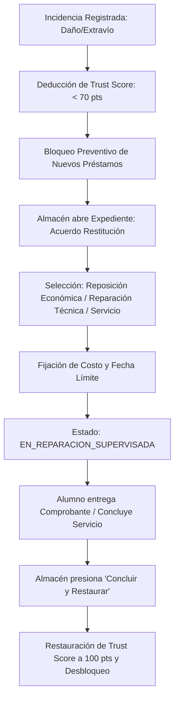

# Manual de Operación: Almacén, Espacios y Administración — SIGRE CUTonalá

**Sistema Integrado de Gestión de Recursos y Espacios (SIGRE)**  
*Centro Universitario de Tonalá (Universidad de Guadalajara)*  
*Enfoque: Formulación y Evaluación de Proyectos de Inversión*

---

## 📌 Introducción y Perfiles Operativos

Este documento establece las directivas y procedimientos técnicos obligatorios para el personal responsable de la custodia del patrimonio institucional en **CUTonalá**:
- **Encargados de Almacén e Inventario:** Control de entregas físicas, retornos y revisión del Doble Checklist.
- **Técnicos de Laboratorio y Espacios:** Monitoreo de salas de cómputo, auditorios y Cineteca.
- **Personal de Puerta y Taquilla:** Validación de boletos QR y control de aforo.
- **Coordinadores y Superadministradores:** Dictamen de solicitudes ("Rebote Motivado"), formalización de compromisos de reparación y monitoreo del Dashboard Ejecutivo de Inversión.

---

## 📷 1. Control de Accesos: Escáner QR con Cámara Física

Para la verificación de boletos en la entrada de la **Cineteca (Sala Guillermo del Toro)** o eventos en auditorios, el sistema integra un módulo de escaneo directo con cámara web o cámara de dispositivo móvil.

### 1.1 Activación del Escáner
1. En el encabezado superior institucional haz clic en el icono de cámara **📷**, o en la vista de **Cartelera Cineteca** presiona el botón **"Escáner de Acceso (Cámara QR)"**.
2. Se desplegará el **Modal de Escáner de Acceso QR (Puerta / Taquilla)** con las siguientes capacidades:
   - **Visor HUD de Video en Vivo:** Muestra la transmisión de la cámara con retícula de auto-enfoque y línea láser animada.
   - **Selector de Cámara:** Permite alternar entre la cámara trasera (*environment / back*) y frontal (*user / front*), ideal para tabletas y smartphones de guardia.
   - **Subir Imagen QR:** Permite cargar archivos fotográficos o capturas de pantalla si el lente físico está dañado o sucio.
   - **Pruebas & Simulación:** Pestaña con atajos para pruebas rápidas de validación.

### 1.2 Interpretación de Resultados y Respuestas
Al enfocar el código QR del asistente, el motor analiza el payload criptográfico y consulta la API en tiempo real (`POST /api/v1/events/scan-ticket`):

| Resultado | Indicador Visual | Señal Sonora | Acción del Operador |
| :--- | :---: | :---: | :--- |
| **Acceso Autorizado** | 🟢 Tarjeta Verde | Tono agudo dual (*Chime*) | **Permitir acceso.** Muestra el nombre del alumno, código UdeG, carrera y hora de ingreso. El estatus cambia a `ASISTIÓ`. |
| **Ya Escaneado Previamente** | 🟡 Tarjeta Ámbar | Tono medio (*Buzzer*) | **Denegar reingreso o aclarar.** Advierte la hora exacta en que ya fue presentado ese boleto. Evita el paso de múltiples personas con el mismo boleto. |
| **Código Inválido / Expirado** | 🔴 Tarjeta Roja | Tono grave descendente | **Denegar acceso.** El código no pertenece a la base de datos institucional o su firma digital HMAC no coincide. |

3. Para recibir al siguiente asistente en la fila, presiona el botón **"Escanear Siguiente Boleto"** para reactivar el lente inmediatamente.

---

## 🔄 2. Evaluación de Solicitudes y "Rebote Motivado" (RF-02.2)

Cuando un estudiante o profesor solicita un préstamo o aula, la solicitud pasa a estado `PENDIENTE_APROBACION`.

### Criterios de Evaluación:
1. **Historial del Solicitante:** Verificar el **Trust Score** del usuario. Si es menor a 70 puntos, el sistema bloqueará la entrega hasta regularizar incidencias previas.
2. **Disponibilidad:** El sistema ya garantiza que no haya empalmes horarios mediante Redis, pero Almacén debe evaluar la viabilidad de mantenimiento o insumos.
3. **Dictamen Administrativo:**
   - **Aprobar:** Habilita la emisión de la responsiva digital.
   - **Rebotar con Motivo:** NUNCA se rechaza de forma arbitraria. El técnico DEBE redactar un mensaje específico y orientativo, por ejemplo:
     > *"Rechazado: El préstamo de la cámara Cinema Line requiere cableado HDMI adicional que no solicitaste. Por favor genera una nueva solicitud agregando el Kit de Cables #4."*
     > *"Rechazado: El auditorio se autoriza hasta las 18:00 hrs por labores de fumigación en el Edificio de Rectoría."*

---

## 📋 3. Procedimiento de Entrega y Doble Checklist Digital (RF-04.2)

Para garantizar la indemnidad del patrimonio y deslindar responsabilidades, cada préstamo exige dos revisiones digitales en ventanilla:

### 3.1 Checklist de Salida (Entrega Física)
Al entregar el equipo en mostrador:
1. Localiza el folio en la pestaña **Inventario & Préstamos** > **Checklist Salida**.
2. Revisa físicamente el activo junto con el alumno:
   - Condición física: *Excelente / Buena / Con marcas de uso*.
   - Verificación de accesorios: Marcar individualmente cada componente entregado (cargador, batería, tapa de lente, estuche, cables).
   - Observaciones: Anotar cualquier raspón o detalle preexistente.
3. El técnico y el solicitante ratifican la entrega con su firma digital.

### 3.2 Checklist de Entrada (Devolución)
Al momento en que el alumno devuelve el equipo:
1. Localiza el folio en **Checklist Entrada**.
2. Realiza la inspección física y funcional (encendido, estado del lente, teclado, puertos).
3. Si el equipo regresa íntegro y a tiempo:
   - Se marca como devuelto conforme.
   - El Trust Score del alumno se mantiene en 100 pts o suma mérito.
4. Si se detecta un daño o faltante:
   - Se abre el módulo de **Registro de Incidencias**.

---

## ⚠️ 4. Gestión de Incidencias y Reparación de Daños Supervisada (RF-01.3)

Cuando un equipo sufre una avería o un alumno incurre en faltas reiteradas, su Trust Score desciende.

### 4.1 Apertura del Expediente de Reparación Supervisada
Cuando el **Trust Score cae por debajo de 70 puntos**, el sistema emite una alerta restrictiva y activa el flujo formal de restitución para el técnico de almacén:

1. En la vista **Incidentes & Reparaciones**, ubica el caso pendiente (ej. `INC-2026-0003: Daño Grave en Lente de Enfoque`).
2. Haz clic en el botón **"Acuerdo Restitución"**.
3. Se desplegará el modal oficial donde Almacén registra:
   - **Tipo de Compromiso Formal:**
     - `REPOSICION_ECONOMICA`: Pago del deducible o reemplazo de la pieza con proveedor autorizado.
     - `REPARACION_TECNICA`: Servicio en taller autorizado con factura y dictamen técnico.
     - `SERVICIO_LABORATORIO`: Compensación de horas de servicio técnico en el taller de mantenimiento de CUTonalá.
   - **Costo Estimado (MXN)** u Horas de Servicio.
   - **Fecha Límite de Cumplimiento.**
   - **Notas de Supervisión de Almacén:** Cláusulas de seguimiento formal.
4. Al guardar, el estatus del expediente pasa a `EN_REPARACION_SUPERVISADA`.

### 4.2 Cierre del Expediente y Restauración de Puntos
Una vez que el estudiante entrega el comprobante de pago, la refacción nueva o concluye sus horas de servicio:
1. El técnico ingresa a la incidencia y presiona **"Concluir y Restaurar"**.
2. El sistema restaura los puntos del score al usuario y levanta las restricciones de préstamo de manera inmediata y auditable.

---

## 📊 5. Panel de Control y Evaluación Financiera (RF-05.1)

El **Panel de Control** proporciona a la Coordinación General y directivos la información ejecutiva en tiempo real sobre la rentabilidad y aprovechamiento de los activos.

### 5.1 Indicadores Operativos Clave
- **Espacios Físicos:** Total de aulas y auditorios censados y tasa de ocupación horaria.
- **Bienes de Inventario:** Volumen total de activos y flota en comodato.
- **Reservas Aprobadas y Préstamos en Curso:** Concurrencia actual en el campus.
- **Incidentes Abiertos:** Casos en resolución o en proceso de reparación supervisada.

### 5.2 Evaluación Financiera y Retorno de Inversión (Proyecto de Inversión)
En la sección **Evaluación Financiera & Retorno de Inversión**:
- **Inversión Inicial (CAPEX):** $466,242.00 MXN en equipamiento, servidores y adecuación.
- **Tasa Interna de Retorno (TIR):** **22.84%** (superando la tasa de descuento de referencia institucional del 12%).
- **Valor Presente Neto (VPN):** **+$268,415.00 MXN** a 3 años de horizonte evaluativo.
- **Periodo de Recuperación (Payback):** **2.4 años**.
- **Matriz de Desgaste de Flota:** Monitoreo del ciclo de vida útil de equipos para programar mantenimientos preventivos antes de que ocurra una falla crítica en préstamo.

---

## 🎥 6. Demostración en Video del Flujo Completo

Puedes consultar y proyectar la grabación de demostración del sistema en:
- **Video Walkthrough:** [`sigre_demo_walkthrough.webp`](file:///c:/Users/erfierro/Documents/Inversion/docs/pruebas/sigre_demo_walkthrough.webp)
