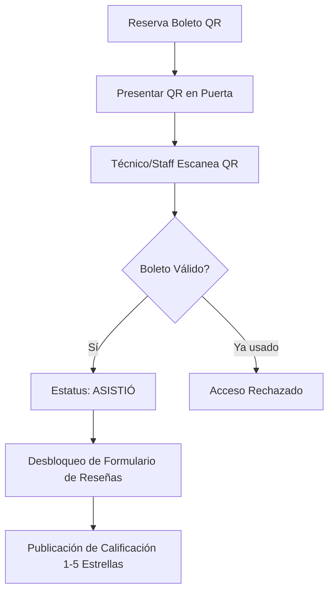

# Manual de Usuario: Comunidad Estudiantil y Docente — SIGRE CUTonalá

**Sistema Integrado de Gestión de Recursos y Espacios (SIGRE)**  
*Centro Universitario de Tonalá (Universidad de Guadalajara)*  
*Enfoque: Formulación y Evaluación de Proyectos de Inversión*

---

## 📌 Introducción y Propósito

El presente manual tiene como objetivo guiar a los alumnos, profesores e investigadores del **Centro Universitario de Tonalá (CUTonalá)** en el uso de la plataforma **SIGRE**. 

A través de esta plataforma institucional podrás:
1. Consultar la cartelera cultural y proyecciones de la **Cineteca CUTonalá (Sala Guillermo del Toro)** y reservar tus boletos digitales con código QR criptográfico.
2. Calificar y emitir **reseñas verificadas** de las proyecciones y eventos a los que asistas.
3. Solicitar la reserva de aulas, laboratorios y auditorios con sistema **anti-empalme en tiempo real**.
4. Solicitar préstamos de equipo audiovisual, cómputo y laboratorio con firma digital en acta responsiva oficial.
5. Gestionar la firma remota de **co-responsables** para proyectos de equipo.
6. Consultar tu **Score de Confiabilidad (Trust Score)** y dar seguimiento a responsivas emitidas.

---

## 🎬 1. Acceso e Identidad Institucional

### 1.1 Credenciales y Horario Operativo
- **Acceso Autorizado:** El sistema valida cuentas con dominio oficial `@alumnos.udg.mx` o `@academicos.udg.mx`, así como Google OAuth institucional.
- **Horario Oficial CUTonalá:** Lunes a Sábado de **08:00 a 19:00 hrs**. El sistema cuenta con un reloj institucional sincronizado en el encabezado.
- **Modo Oscuro / Claro:** Puedes alternar el tema visual en el icono de sol/luna ubicado en la esquina superior derecha.

### 1.2 Sesión y Perfil del Alumno
Al iniciar sesión, el encabezado mostrará tu nombre, código de estudiante, carrera y tu distintivo de **Reputación Institucional (Trust Score: 100 pts iniciales)**.

---

## 🎟️ 2. Cartelera de Cineteca y Boletos QR

### 2.1 Consulta de Cartelera
En la pestaña **Cartelera Cineteca** se despliegan las funciones vigentes en la Sala Guillermo del Toro y auditorios del campus, detallando:
- Título, sinopsis y clasificación.
- Fecha, horario y sala física.
- Contador dinámico de butacas disponibles.
- Promedio de estrellas de la comunidad universitaria.

### 2.2 Reserva de Butaca y Boleto Digital QR
1. Haz clic en el botón **"Reservar Asiento QR"** de la función elegida.
2. El sistema apartará tu lugar y generará un **Boleto Digital con Código QR Dinámico** con firma criptográfica HMAC SHA-256.
3. Guarda la captura del boleto o muéstralo desde tu celular al llegar a la puerta de la sala.

> [!IMPORTANT]
> Los códigos QR son personales e intransferibles. Cada boleto solo puede ser escaneado una vez por el personal de sala para cambiar su estado a `ASISTIÓ`.

---

## ⭐ 3. Reseñas Verificadas de Eventos (RF-03.3)

Para garantizar opiniones auténticas y libres de bots, **solo los usuarios cuyo boleto haya sido escaneado físicamente en puerta** tienen acceso al formulario de reseña.

### Pasos para Calificar una Proyección:
1. Dirígete a la pestaña **Mis Solicitudes & Responsivas** > sección **Mis Boletos Cineteca**.
2. Ubica la función a la que asististe y haz clic en **"Calificar Proyección ⭐"** (o en la cartelera sobre el botón de estrellas del filme).
3. Selecciona tu calificación (1 a 5 estrellas).
4. Escribe tus comentarios u observaciones sobre la calidad de la proyección, sonido o contenido.
5. Haz clic en **"Publicar Reseña Verificada"**. Tu reseña aparecerá públicamente con el distintivo de verificación `✓ Asistió`.

---

## 🏛️ 4. Reserva de Espacios y Aulas (Anti-Empalme)

### 4.1 Exploración y Disponibilidad
En la pestaña **Espacios & Aulas** puedes filtrar por tipo de espacio (Auditorios, Salas de Cómputo, Laboratorios, Cineteca). Cada ficha indica equipamiento, capacidad y reglamento interno.

### 4.2 Proceso de Reserva y Bloqueo Temporal (Soft-Lock Redis)
1. Selecciona el espacio deseado y haz clic en **"Solicitar Reserva"**.
2. Define la **fecha, hora de inicio y hora de fin**.
3. Al seleccionar el horario, el sistema adquiere automáticamente un **Bloqueo Temporal de 15 Minutos en Redis** (`soft-lock`) para apartar el espacio mientras completas el formulario y redactas la justificación académica.
4. Si otro usuario intenta reservar el mismo espacio y horario en simultáneo, recibirá una advertencia de disponibilidad.
5. Completa el motivo académico, número de asistentes estimados y confirma la solicitud.

---

## 📦 5. Préstamo de Materiales y Firma Digital

### 5.1 Catálogo de Inventario
En la pestaña **Inventario & Préstamos** consulta la flota disponible clasificada por categorías (Audiovisual, Cómputo, Laboratorio, Iluminación).

### 5.2 Solicitud y Firma Digital en Canvas (RF-04.1)
1. Haz clic en **"Solicitar Préstamo"** sobre el bien requerido (ej. *Cámara Sony FX3 Cinema Line* o *Laptop ThinkPad T14*).
2. Especifica el rango de fechas de uso. Para préstamos mayores a 48 hrs, activa la casilla de préstamo extendido e ingresa la justificación del proyecto.
3. Si el equipo es para un proyecto grupal, ingresa el **código de estudiante de tu Co-Responsable**.
4. En el paso final, se abrirá el **Modal de Firma Digital en Canvas HTML5**:
   - Dibuja tu firma gráfica con el mouse o con tu dedo en dispositivos táctiles.
   - El sistema calculará un hash criptográfico SHA-256 asociado a tu código de estudiante y dirección IP.
   - Haz clic en **"Estampar Firma y Aceptar"**.

### 5.3 Firma Remota de Co-Responsables (RF-02.3)
Si registraste a un compañero de equipo como co-responsable:
- Tu compañero recibirá un correo electrónico transaccional con una liga temporal segura (`/responsivas/:id/firmar?token=...`).
- Podrá abrir el enlace en su propio teléfono móvil y estampar su firma digital sin necesidad de acudir a la ventanilla al mismo tiempo que tú.
- En la tabla de **Mis Solicitudes**, podrás ver el estado de la firma (`✓ Firmado` o `⏳ Firma Pendiente`) y presionar **"Reenviar Correo"** si es necesario.

---

## 📄 6. Actas Responsivas Oficiales y Checklists

En la pestaña **Mis Solicitudes & Responsivas**:
1. Consulta el listado histórico de tus solicitudes de espacios y préstamos.
2. Para cada préstamo activo o concluido, haz clic en **"Descargar PDF"** para obtener el documento oficial emitido por el motor **PDFKit**, el cual incluye:
   - Folio institucional oficial (ej. `PREST-2026-0041`).
   - Matrícula y datos del titular y co-responsables.
   - Detalle de accesorios y número de serie del activo.
   - Firmas estampadas en base64 y sellos de tiempo.

---

## 🛡️ 7. Política de Confiabilidad (Trust Score)

El sistema opera bajo un modelo de incentivo y corresponsabilidad patrimonial:

| Puntuación | Estado | Privilegios |
| :---: | :---: | :--- |
| **90 – 100 pts** | 🟢 Ejemplar | Aprobación automática de solicitudes estándar; acceso prioritario a equipo especializado. |
| **70 – 89 pts** | 🟡 Regular | Solicitudes sujetas a revisión manual de almacén; préstamos estándar permitidos. |
| **< 70 pts** | 🔴 Restringido | **Bloqueo preventivo de nuevas solicitudes.** Requiere formalizar un acuerdo en el **Flujo de Reparación de Daños Supervisado** con Almacén. |

### Deducciones por Incidencias:
- **Retraso menor (< 2 horas):** Advertencia formal (-0 pts).
- **Retraso grave (> 2 horas):** -5 pts.
- **Falta de accesorio menor (tapa, cable HDMI):** -10 pts.
- **Daño físico o mal uso reportado:** -20 a -30 pts.

---

## 🎥 8. Video Demostrativo

Para ver una interacción en vivo del flujo completo (inicio de sesión, validación con escáner QR, catálogo y navegación ejecutiva), consulta la grabación oficial:
- **Archivo:** [`sigre_demo_walkthrough.webp`](file:///c:/Users/erfierro/Documents/Inversion/docs/pruebas/sigre_demo_walkthrough.webp)
