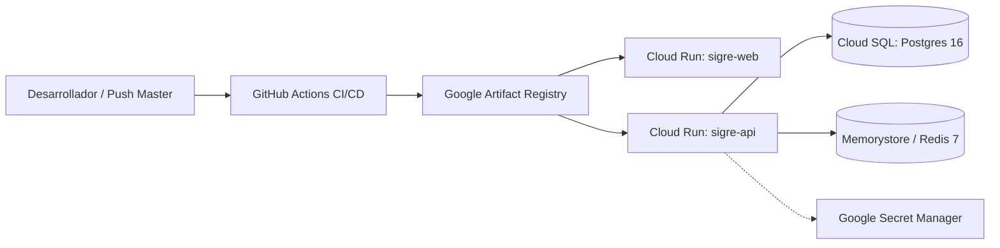

# Despliegue en la Nube y DevOps (GCP Cloud Run & CI/CD)

**Módulo:** Infraestructura, Dockerización y Entrega Continua  
**Fecha de formalización:** 2026-10-05  
**Documento técnico detallado:** [[DESPLIEGUE_GCP|docs/arquitectura/DESPLIEGUE_GCP.md]]

---

## 1. Visión General de la Infraestructura

El sistema **SIGRE** adopta una arquitectura de contenedores sin servidor (*Serverless Containers*) en **Google Cloud Platform (GCP)** para garantizar alta disponibilidad, máxima seguridad institucional y control estricto de costos operativos (*FinOps*).

---

## 2. Contenedores de Producción Multi-Stage

* **Backend (`apps/api/Dockerfile`):**
  * Base: `node:20-slim`.
  * Compilación TypeScript a JavaScript y generación del cliente Prisma v5.22.
  * Usuario no privilegiado (`USER node`) para prevenir escalamiento de privilegios.
  * *Healthcheck* nativo HTTP en `/health`.
* **Frontend (`apps/web/Dockerfile`):**
  * Compilación de assets con Vite y empaquetado en imagen `nginx:1.27-alpine` (< 30 MB).
  * Soporte nativo para rutas HTML5 History (React Router) en `apps/web/nginx.conf`.
  * Compresión Gzip y cabeceras de seguridad estrictas (`X-Frame-Options`, `nosniff`).

---

## 3. Pipeline Automatizado de CI/CD (`.github/workflows/ci-cd.yml`)

1. **Fase CI (Integración Continua):**
   * Validación estricta de compilación con TypeScript (`turbo run build`).
   * Ejecución automatizada de la suite de pruebas E2E con **Playwright**.
   * Reportes de prueba exportados automáticamente como artefactos de GitHub.
2. **Fase CD (Despliegue Continuo a GCP):**
   * Activación automática tras *push* aprobado a la rama `master`.
   * Construcción paralela de imágenes Docker con buildx.
   * Publicación de imágenes versionadas con el SHA del commit en Google Artifact Registry.
   * Despliegue con cero tiempo de inactividad (*Zero-Downtime Rolling Update*) en Cloud Run.

---

## 4. Estrategia FinOps Universitaria

* **Escala a Cero (`--min-instances 0`):** Cuando no hay tráfico lectivo (madrugadas o vacaciones), la infraestructura no genera costo por cómputo ocioso.
* **Topes de Concurrencia:** Máximo 5 instancias por servicio para proteger el presupuesto de GCP.

---

## 5. Enlaces Relacionados

* [[ARQUITECTURA_SIGRE]]
* [[Concurrencia_Redis]]
* [[Autenticacion_Google]]
* [[Index]]
