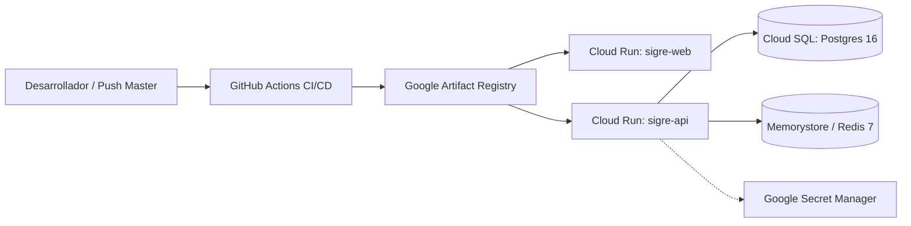

# Despliegue en la Nube y DevOps (GCP Cloud Run & CI/CD)

**Módulo:** Infraestructura, Dockerización y Entrega Continua  
**Fecha de formalización:** 2026-10-05  
**Documento técnico detallado:** [[DESPLIEGUE_GCP|docs/arquitectura/DESPLIEGUE_GCP.md]]

---

## 1. Visión General de la Infraestructura

El sistema **SIGRE** adopta una arquitectura de contenedores sin servidor (*Serverless Containers*) en **Google Cloud Platform (GCP)** para garantizar alta disponibilidad, máxima seguridad institucional y control estricto de costos operativos (*FinOps*).

---

## 2. Contenedores de Producción Multi-Stage

* **Backend (`apps/api/Dockerfile`):**
  * Base: `node:20-slim`.
  * Compilación TypeScript a JavaScript y generación del cliente Prisma v5.22.
  * Usuario no privilegiado (`USER node`) para prevenir escalamiento de privilegios.
  * *Healthcheck* nativo HTTP en `/health`.
* **Frontend (`apps/web/Dockerfile`):**
  * Compilación de assets con Vite y empaquetado en imagen `nginx:1.27-alpine` (< 30 MB).
  * Soporte nativo para rutas HTML5 History (React Router) en `apps/web/nginx.conf`.
  * Compresión Gzip y cabeceras de seguridad estrictas (`X-Frame-Options`, `nosniff`).

---

## 3. Pipeline Automatizado de CI/CD (`.github/workflows/ci-cd.yml`)

1. **Fase CI (Integración Continua):**
   * Validación estricta de compilación con TypeScript (`turbo run build`).
   * Ejecución automatizada de la suite de pruebas E2E con **Playwright**.
   * Reportes de prueba exportados automáticamente como artefactos de GitHub.
2. **Fase CD (Despliegue Continuo a GCP):**
   * Activación automática tras *push* aprobado a la rama `master`.
   * Construcción paralela de imágenes Docker con buildx.
   * Publicación de imágenes versionadas con el SHA del commit en Google Artifact Registry.
   * Despliegue con cero tiempo de inactividad (*Zero-Downtime Rolling Update*) en Cloud Run.

---

## 4. Topología Nativa 100% Google Cloud (leadforge-499919)

Toda la infraestructura vive de forma soberana dentro del proyecto institucional de GCP:

| Componente | Servicio GCP | Identificador / Recurso | Propósito |
| :--- | :--- | :--- | :--- |
| **API Backend** | Cloud Run | `sigre-api` | Microservicio Express/Node.js con escalado a cero |
| **Frontend Web** | Cloud Run | `sigre-web` | Servidor Nginx Alpine sirviendo SPA React 18 |
| **Imágenes Docker** | Artifact Registry | `sigre` (us-central1) | Repositorio privado de imágenes inmutables |
| **Base de Datos** | Cloud SQL | `sigre-postgres` (PostgreSQL 16) | Persistencia ACID, modelos Prisma y auditoría |
| **Anti-Empalme** | Memorystore | `sigre-redis` (Redis 7) | Bloqueo distribuido atómico (TTL 15 min) |
| **Red Privada** | VPC Access | `sigre-vpc-connector` (10.8.0.0/28) | Canal privado entre Cloud Run, SQL y Memorystore |
| **Archivos & Actas**| Cloud Storage | `gs://sigre-storage-leadforge-499919` | Almacenamiento seguro de PDFs de actas y fotos |
| **Anti-Bots / Spam**| reCAPTCHA Enterprise | `6Le4keItAAAAAP9kezXQe4kjl7kopvvoQ9gTPQuU` | Validación de score transparente sin fricción |
| **Baúl Criptográfico** | Secret Manager | `SIGRE_JWT_*` y `SIGRE_DATABASE_URL` | Cero credenciales planas en código o entorno |

---

## 5. Estrategia FinOps Universitaria

* **Escala a Cero (`--min-instances 0`):** Cuando no hay tráfico lectivo (madrugadas o vacaciones), la infraestructura no genera costo por cómputo ocioso.
* **Topes de Concurrencia:** Máximo 5 instancias por servicio para proteger el presupuesto de GCP.
* **Caché en Nginx y GCS:** Los assets estáticos se descargan directamente con cabeceras de caché inmutable para no consumir ciclos de CPU en el backend.

---

## 5. Enlaces Relacionados

* [[ARQUITECTURA_SIGRE]]
* [[Concurrencia_Redis]]
* [[Autenticacion_Google]]
* [[Index]]
